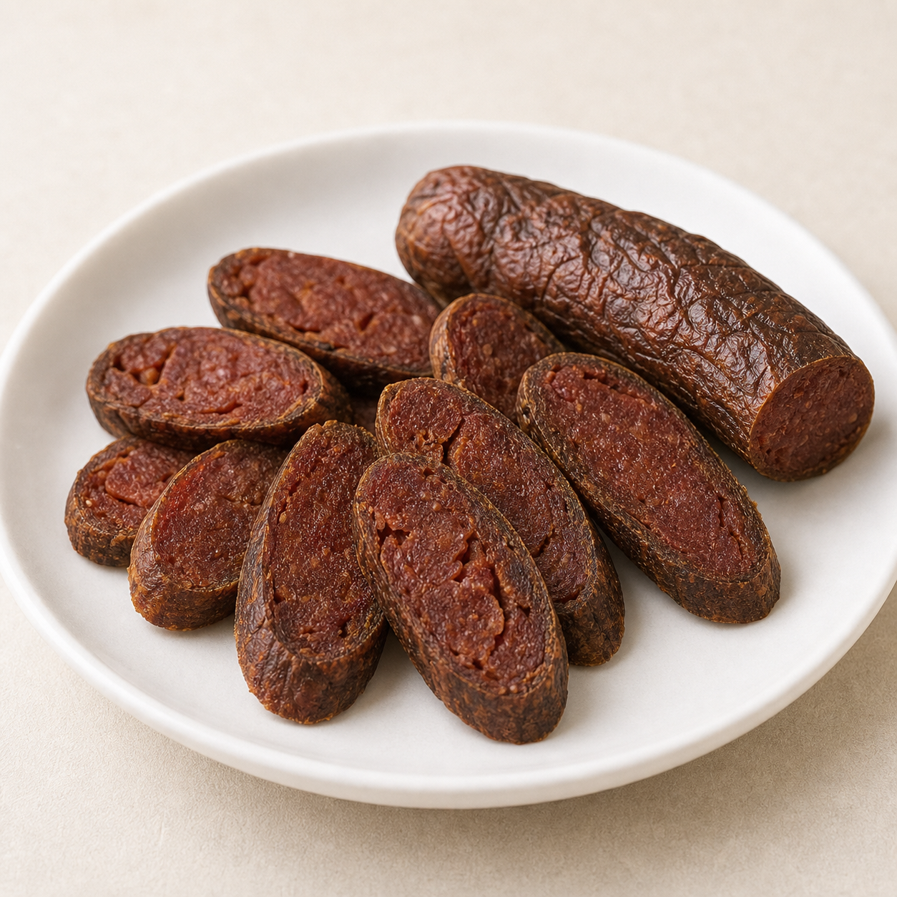

<!DOCTYPE html>
<html lang="th">
<head>
  <meta charset="UTF-8" />
  <meta name="viewport" content="width=device-width, initial-scale=1.0" />
  <title>Customer UI Directions Demo</title>
  <link rel="stylesheet" href="customer-ui-demo.css" />
</head>
<body>
  <header class="demo-hero">
    
Customer UI/UX Moodboard Demo

    <h1>3 แนวทางหน้าลูกค้า สำหรับร้านปอเปี๊ยะสด</h1>
    

      แต่ละแบบเป็นคนละ direction จริง: โทนสี ฟอนต์ บรรยากาศ และ hero visual ต่างกัน
      แต่ยังคง practical, delicious, และพร้อมนำไปใช้เป็น demo ต่อได้
    

  </header>

  <main class="directions">
    <section class="direction direction--garden" data-pattern="garden" data-price="50">
      

        

          Pattern 01
          <h2>สวนครัวอบอุ่น</h2>
          

            อารมณ์ร้านอาหารบ้าน ๆ ที่สะอาด นุ่ม และจริงใจ ให้ภาพอาหารเป็นพระเอก
            เหมาะกับร้านเล็กที่อยากดูน่าเชื่อถือโดยไม่หรูเกินไป
          

        

        

          <h3>Color Palette</h3>
          

            
              <i style="--swatch: #06c755"></i>
              <strong>LINE Green</strong>
              <small>#06C755</small>
            
            
              <i style="--swatch: #e8f7e9"></i>
              <strong>Soft Lime</strong>
              <small>#E8F7E9</small>
            
            
              <i style="--swatch: #fff4c2"></i>
              <strong>Warm Yellow</strong>
              <small>#FFF4C2</small>
            
            
              <i style="--swatch: #f7f8f6"></i>
              <strong>Rice Paper</strong>
              <small>#F7F8F6</small>
            
            
              <i style="--swatch: #8b8f94"></i>
              <strong>Warm Gray</strong>
              <small>#8B8F94</small>
            
          

        

      

      

        Typography: Friendly · Clear · Modern
        อ่านง่าย อบอุ่น เป็นมิตร
        Atmosphere: สดใหม่ น่ากิน ใช้งานง่าย เร็ว
        Hero: Fresh & Tasty product tile
      

      

        

          Aa
          

            <strong>Friendly · Clear · Modern</strong>
            <small>อ่านง่าย อบอุ่น เป็นมิตร</small>
          

        

        

          <h3>UI Atmosphere</h3>
          
<b>สดใหม่ น่ากิน</b><small>Fresh & Delicious</small>

          
<b>ใช้งานง่าย เร็ว</b><small>Simple & Fast</small>

          
<b>อบอุ่น เป็นกันเอง</b><small>Warm & Friendly</small>

          
<b>LINE เข้าใจง่าย</b><small>LINE-native feel</small>

        

        

          
          <strong>Fresh &amp; Tasty!</strong>
        

      

      

        <article class="phone garden-phone">
          

          

            

              สดใหม่วันนี้
              <strong>ปอเปี๊ยะโฮมเมด</strong>
            

            

              
              

              

            

            

              

                
เมนูแนะนำ

                <h3 data-garden-title>ปอเปี๊ยะสดไส้รวม</h3>
                
เต้าหู้ กุนเชียง ผักสด และน้ำจิ้มถั่วรสกลมกล่อม

              

              
฿50

            

            

              

                เลือกเมนูเพิ่ม
                <small>เลื่อนดูได้</small>
              

              

                <button class="mini-product is-active" type="button" data-product-card data-product-id="roll">
                  
                  <strong>ปอเปี๊ยะสด</strong>
                  ฿50
                  <em data-card-qty="roll">1</em>
                </button>
                <button class="mini-product" type="button" data-product-card data-product-id="tofu">
                  
                  <strong>เต้าหู้</strong>
                  ฿25
                  <em data-card-qty="tofu">0</em>
                </button>
                <button class="mini-product" type="button" data-product-card data-product-id="sausage">
                  
                  <strong>กุนเชียง</strong>
                  ฿35
                  <em data-card-qty="sausage">0</em>
                </button>
              

            

            

              จำนวนปอเปี๊ยะสด
              

                <button type="button" data-garden-action="minus" aria-label="ลดจำนวน">−</button>
                <strong data-garden-current-quantity>1</strong>
                <button type="button" data-garden-action="plus" aria-label="เพิ่มจำนวน">+</button>
              

            

            

              

                ตะกร้าของคุณ
                <strong data-garden-cart-count>1 รายการ</strong>
              

              
ปอเปี๊ยะสด x1

            

            <button class="main-cta sticky-cta" type="button">ชำระเงิน ฿50</button>
          

        </article>

        <article class="phone garden-phone payment-phone">
          

          

            PromptPay
            <h3>ชำระเงิน</h3>
            
สแกน QR ด้วยแอปธนาคาร หรือดาวน์โหลด QR เพื่อไปสแกนต่อ

            <strong class="payment-total" data-garden-total>฿50</strong>
            

              รายการ
              
ปอเปี๊ยะสด x1

            

            

              

            

            <button class="download-btn" type="button">ดาวน์โหลด QR Code</button>
            <button class="upload-btn" type="button">อัปโหลดสลิปโอนเงิน</button>
            <small>ร้านจะยืนยันคำสั่งซื้อหลังตรวจสอบสลิป</small>
          

        </article>
      

    </section>

    <section class="direction direction--market" data-pattern="market" data-price="50">
      

        

          Pattern 02
          <h2>ตลาดเช้าคลีน</h2>
          

            สดใสกว่าแบบแรก เหมาะกับอนาคตที่มีหลายสินค้า ให้ความรู้สึกเลือกง่าย
            คล้ายร้านอาหารใน LINE ที่เร็ว เป็นมิตร และเห็นรายการชัด
          

        

        

          
          
          
          
        

      

      

        Typography: สดใส เป็นกันเอง
        Atmosphere: ตลาดเช้าสะอาด เลือกเร็ว
        Hero: ถาดสินค้าแบบ horizontal tile
      

      

        <article class="phone market-phone">
          

          

            

              

                เปิดรับออเดอร์
                <h3>เลือกชุดอร่อย</h3>
              

              
1

            

            

              

                
                <strong>ปอเปี๊ยะสด</strong>
              

              

                
                <strong>เต้าหู้</strong>
              

              

                
                <strong>กุนเชียง</strong>
              

            

            

              ขายดีวันนี้
              <h3>ปอเปี๊ยะสดไส้รวม</h3>
              
น้ำจิ้มถั่วโฮมเมด แยกน้ำจิ้มให้ พร้อมทาน

              

                <strong>฿50 / ชุด</strong>
                

                  <button type="button" data-action="minus" aria-label="ลดจำนวน">−</button>
                  <strong data-quantity>1</strong>
                  <button type="button" data-action="plus" aria-label="เพิ่มจำนวน">+</button>
                

              

            

            <button class="main-cta main-cta--market" type="button">ไปชำระเงิน ฿50</button>
          

        </article>

        <article class="phone market-phone payment-phone">
          

          

            

              สรุปยอด
              <strong data-total>฿50</strong>
            

            

              ปอเปี๊ยะสดไส้รวม
              1 ชุด
            

            

              

            

            
สแกนจ่ายผ่าน PromptPay แล้วแนบสลิปเพื่อให้ร้านยืนยัน

            <button class="download-btn download-btn--market" type="button">ดาวน์โหลด QR</button>
            <button class="upload-btn upload-btn--market" type="button">แนบสลิป</button>
          

        </article>
      

    </section>

    <section class="direction direction--calm" data-pattern="calm" data-price="50">
      

        

          Pattern 03
          <h2>มินิมอลพร้อมส่ง</h2>
          

            เรียบกว่าแต่ไม่เย็นชา ใช้ภาพใหญ่และพื้นที่ว่างเพื่อให้ดู premium เล็กน้อย
            เหมาะกับ demo ที่อยากให้ดู modern และพร้อมต่อยอดเป็น PWA จริง
          

        

        

          
          
          
          
        

      

      

        Typography: Modern Thai, น้ำหนักชัด
        Atmosphere: สงบ สะอาด พร้อมใช้
        Hero: ภาพ crop ใหญ่แบบ editorial
      

      

        <article class="phone calm-phone">
          

          

            

              
              

                พร้อมส่งวันนี้
                <h3>ปอเปี๊ยะสดไส้รวม</h3>
              

            

            

              
ชุดอิ่มพอดี สด สะอาด พร้อมน้ำจิ้มถั่วโฮมเมด

              

                ฿50 / ชุด
                ทำสดเป็นรอบ
              

              

                

                  จำนวน
                  

                    <button type="button" data-action="minus" aria-label="ลดจำนวน">−</button>
                    <strong data-quantity>1</strong>
                    <button type="button" data-action="plus" aria-label="เพิ่มจำนวน">+</button>
                  

                

                <button class="main-cta main-cta--calm" type="button">สั่งเลย ฿50</button>
              

            

          

        </article>

        <article class="phone calm-phone payment-phone">
          

          

            PromptPay QR
            <h3>ยอดชำระ <strong data-total>฿50</strong></h3>
            

              

            

            

              <button class="download-btn download-btn--calm" type="button">ดาวน์โหลด QR</button>
              <button class="upload-btn upload-btn--calm" type="button">อัปโหลดสลิป</button>
            

            
หลังร้านตรวจสอบสลิปแล้ว ระบบจะแจ้งสถานะคำสั่งซื้อ

          

        </article>
      

    </section>
  </main>

  
</body>
</html>
