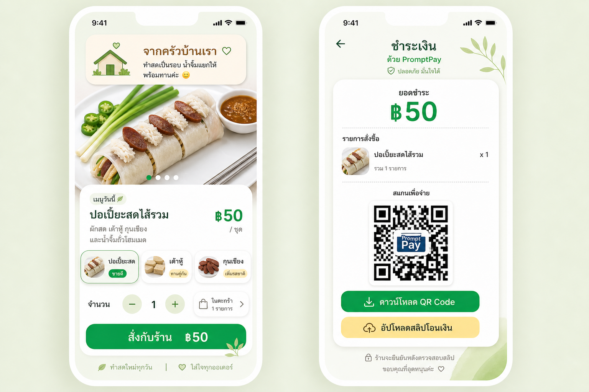

# Visual Direction: Home Kitchen Fresh Soft

This is the visual north star for the customer-facing ordering app.

Reference image:

The app should feel like ordering directly from a small trusted home kitchen: warm, fresh, clean, simple, and LINE-friendly. It should not feel like a large delivery marketplace.

## Color Palette

- Soft Lime Background: `#EEF7E7`
  - Main page atmosphere.
  - Use as the calm outer background and soft gradients.
- Rice White Card: `#FFFDF7`
  - Main card and panel surface.
  - Should feel clean, warm, and food-safe.
- Gentle LINE Green: `#06B954`
  - Primary CTA and active states.
  - Use for order button, QR download button, active product, and selected carousel dot.
- Deep Herb Text: `#123B28`
  - Main heading and important labels.
  - Softer and warmer than pure black.
- Warm Peanut Brown: `#8A5A2C`
  - Home-kitchen accent.
  - Use lightly for owner note, food warmth, and subtle text accents.
- Warm Yellow: `#FFE49A`
  - Secondary action.
  - Use for slip upload button and gentle badges.
- Soft Leaf Green: `#8FB56A`
  - Decoration and supporting icon color.
- Warm Gray: `#7D8378`
  - Helper text, secondary copy, and low-priority information.

## Typography Mood

- Friendly, Thai-first, clear, and warm.
- Headings should be bold and rounded enough to feel human.
- Body text should be highly readable on mobile.
- Prices and payment totals should be large, confident, and easy to scan.
- Avoid corporate, luxury, or overly technical typography.
- Thai copy should sound like a kind shop owner, not a platform system.

Example tone:

- `จากครัวบ้านเรา`
- `ทำสดเป็นรอบ น้ำจิ้มแยกให้ พร้อมทานค่ะ`
- `สั่งกับร้าน`
- `ร้านจะยืนยันหลังตรวจสอบสลิป`

## Layout Principles

- Mobile-first, one-hand friendly.
- Start with a soft owner note to build trust before selling.
- Hero food image should be large and appetizing.
- Product information sits in a rounded rice-white card overlapping the hero image.
- Product tabs should be compact and image-led:
  - `ปอเปี๊ยะสด`
  - `เต้าหู้`
  - `กุนเชียง`
- Quantity controls should be large enough for touch.
- Checkout CTA should be highly visible near the bottom.
- Payment screen should be calmer than the order screen:
  - Large total.
  - Short order summary.
  - Big QR area.
  - Clear download QR and upload slip actions.
- Use soft shadows and rounded corners throughout.
- Decorative leaf/home elements are allowed, but they must stay subtle.

## Food Visual Rules

- Product truth matters more than perfect fantasy food.
- Spring roll wrapper:
  - Dry matte beige/off-white rice paper.
  - Not glossy.
  - Not fluorescent.
  - Not overly bright white.
- Spring roll filling:
  - Chinese sausage.
  - Tofu.
  - A smaller amount of bean sprouts.
- Toppings:
  - Chinese sausage should look like dark reddish-brown rectangular fried blocks/slabs.
  - Prefer front-facing texture, squared corners, visible base/thickness.
  - Avoid oval coin slices.
  - Crab should be clean white lump crab, not shredded into tiny messy flakes.
- Sauce:
  - Sauce must stay separate in a small bowl.
  - Do not pour sauce over the roll in the customer hero image.

## Motion / Interaction Feel

- Interactions should feel quick, light, and familiar to LINE users.
- Product selection should update immediately:
  - Hero image.
  - Product name.
  - Product description.
  - Price.
  - Active product card.
- Quantity changes should update:
  - Quantity number.
  - Cart count.
  - Checkout total.
  - Payment summary.
- Use subtle transitions only:
  - Soft fade for image/content changes.
  - Small active-card highlight.
  - Gentle button press feel.
- Avoid dramatic animation, bouncing, or anything that feels like a game.

## What To Avoid

- Avoid marketplace complexity.
- Avoid dashboard-style boxes and internal-tool layouts.
- Avoid dark heavy premium restaurant styling.
- Avoid sharp square buttons.
- Avoid neon green or fluorescent food lighting.
- Avoid glossy wet rice paper.
- Avoid sauce poured over the product hero.
- Avoid AI food that changes the real product identity.
- Avoid too much text on the first screen.
- Avoid hiding the checkout action.
- Avoid making PromptPay payment feel risky or unclear.
